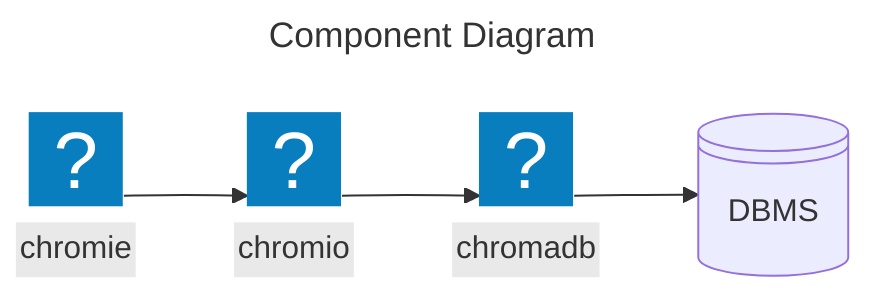
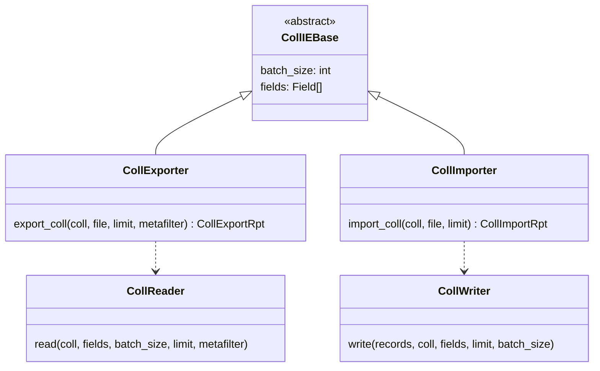
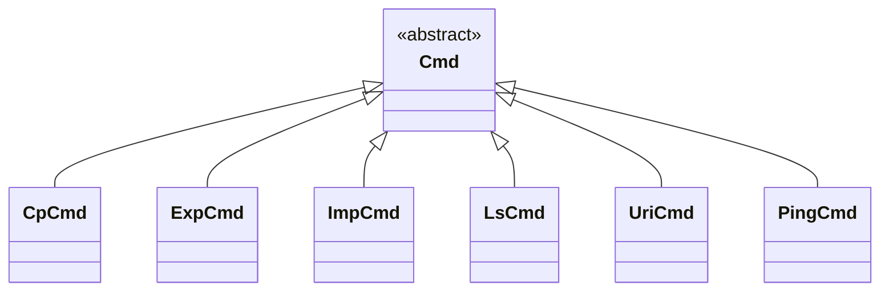

# Design Document: Chromie

## Introduction

### Purpose of *Chromie*

**Chromie** is a command-line interface (CLI) tool designed to facilitate the import and export of data from and to a **Chroma** vector database.

The project is composed of two main parts:

- **chromio**:
  A **Python** library that contains all the business logic to interact with **Chroma**.
  It is reusable and can be integrated into other projects.

- **chromie**:
  The CLI application that consumes the **chromio** library to expose its functionality to the end user through commands.

### Abbreviations

The following abbreviations will be used in the code:

Abbreviations | Description
:--: | :--:
cmd | command
coll | collection
db | database
dir | directory
doc | document
fld | field
ie | import/export
meta | metadata
optor | operator
rec | record
rpt | report

## General Architecture

### Separation of Concerns

**Chromie**'s architecture is based on a clear separation between the business logic and the user interface.

- **chromio** library:

  - It has no knowledge of the CLI.

  - Manages the connection to **Chroma**.

  - Contains the logic for reading, writing, filtering, and transforming data.

  - Defines the data structures for operation reports.

  - It is asynchronous, using **asyncio**.

- **chromie** application:

  - It is the entry point for the user.

  - Uses **argparse** to define and parse commands and arguments.

  - Orchestrates calls to the **chromio** library to execute the requested actions.

  - It is responsible for presenting the results and reports to the user in the console.

### High-level Component Diagram

## *chromio* Library

### Connectivity to *Chroma*

The connection is managed by two main components:

- **`uri`**:
  A connection URI parser, it returns instances of ***`ChromioUri`*** that describe the URI and facilitate access to its components.

- **`client`**:
  A client for a **Chroma** instance, created from a ***`ChromioUri`*** and additional information if necessary.

### Import/Export Engine (`ie`)

It is the core of the library and contains the logic for moving data.

## *chromie* CLI

### Entry Point (*app.py*)

Main program file.

### Command Structure (*cmds/*)

Each command is represented and implemented by a module in this directory.
Each of them inherits from or specializes the ***`Cmd`*** class defined in ***`chromio.tools`***.

