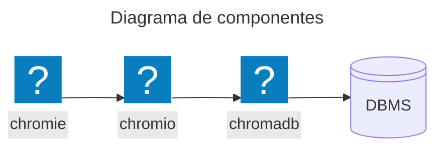
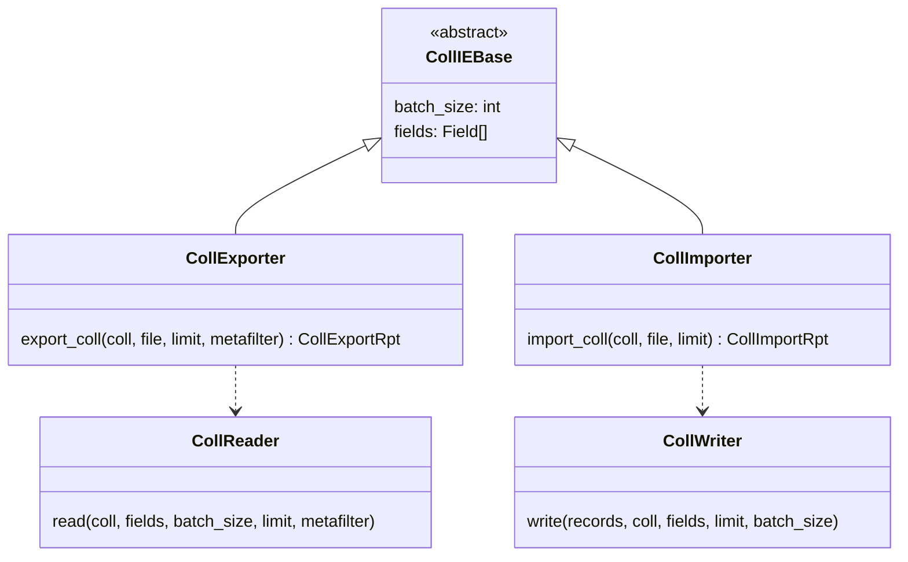
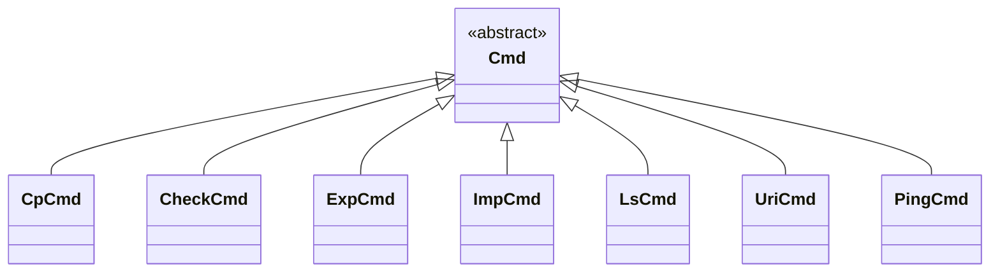

# Documento de diseño: Chromie

## Introducción

### Propósito de *Chromie*

**Chromie** es una herramienta de línea de comandos (CLI) diseñada para facilitar la importación y exportación de datos desde y hacia una base de datos vectorial **Chroma**.

El proyecto está compuesto por dos partes principales:

- **chromio**:
  Una librería de **Python** que contiene toda la lógica de negocio para interactuar con **Chroma**.
  Es reutilizable y puede ser integrada en otros proyectos.

- **chromio**:
  La aplicación CLI que consume la librería **chromio** para exponer su funcionalidad al usuario final a través de comandos.

### Abreviaturas

Las siguientes abreviaturas se utilizarán en el código:

Abreviaturas | Descripción
:--: | :--:
cmd | command
coll | collection
db | database
dir | directory
doc | document
fld | field
ie | import/export
meta | metadata
optor | operator
rec | record
rpt | report

## Arquitectura general

### Separación de responsabilidades

La arquitectura de **Chromie** se basa en una clara separación entre la lógica de negocio y la interfaz de usuario.

- Biblioteca **chromio**:

  - No tiene conocimiento de la CLI.

  - Gestiona la conexión con **Chroma**.

  - Contiene la lógica para leer, escribir, filtrar y transformar datos.

  - Define las estructuras de datos para los reportes de operaciones.

  - Es asíncrona, utiliza **asyncio**.

- Aplicación **chromie**:

  - Es el punto de entrada para el usuario.

  - Utiliza **argparse** para definir y analizar los comandos y argumentos.

  - Orquesta las llamadas a la librería **chromio** para ejecutar las acciones solicitadas.

  - Se encarga de presentar los resultados y reportes al usuario en la consola.

### Diagrama de componentes de alto nivel

## Librería *chromio*

### Conectividad a *Chroma*

La conexión se gestiona mediante dos componentes principales:

- **`uri`**:
  Analizador de URIs de conexión, devuelve instancias de ***`ChromioUri`***que describen el URI y facilita el acceso a sus componentes.

- **`client`**:
  Cliente a uns instancia de **Chroma** a partir de un ***`ChromioUri`*** e información adicional si fuera necesario.

### Motor de importación/exportación (`ie`)

Es el corazón de la librería y contiene la lógica para mover datos.

## CLI *chromie*

### Punto de entrada (*app.py*)

Archivo principal del programa.

### Estructura de comandos (*cmds/*)

Cada comando se representa e implementa mediante un módulo en este directorio.
Cada uno de ellos hereda o especializa la clase ***`Cmd`*** definida en ***`chromio.tools`***.

