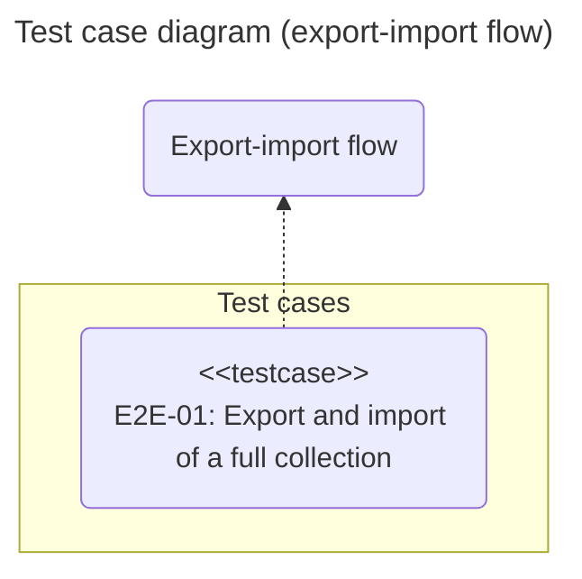
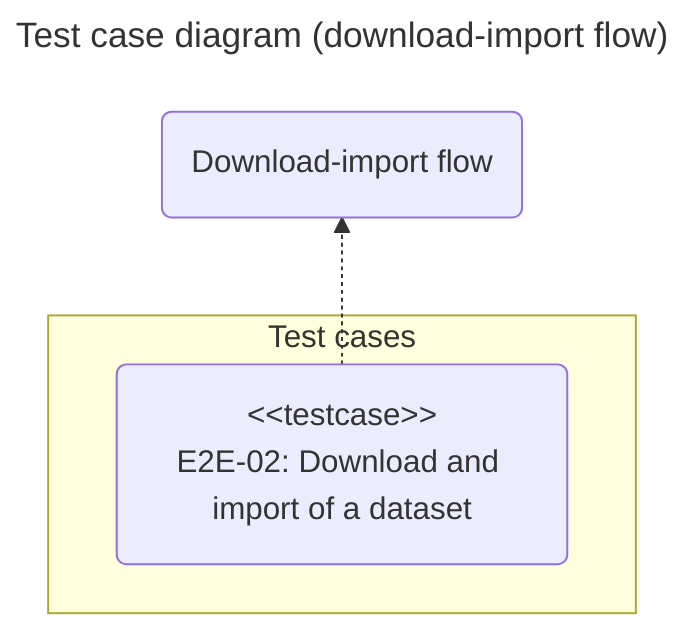

# E2E Tests: chromie


## Introduction

The purpose of this document is to define and describe the End-to-End (E2E) test cases for the **chromie** command-line application.
The idea is to ensure a structured approach, focusing on complete workflows that simulate real user scenarios from start to finish.

The tests are designed using a **black-box** approach, validating the application's observable behavior (inputs and outputs) without knowledge of its internal structure.


## Scope

The complete workflows of **chromie** that combine multiple commands to achieve a final goal will be validated. Initially, the following flow will be covered:

- **Export and import**: Export a full collection and then import it into a new collection.

- **Download and import**: Download a *dataset* and import it into a new collection.


## Test environment

All tests will be run in a controlled environment with the following configuration:

Dependency | Type | Description
:---: | :---: | :---
Hardware | Internal | Machine with at least 2GB of RAM
Operating system | Internal | Ubuntu 24.04
Python | Internal | 3.13
Test framework | Internal | pytest 8.4
Chroma | Internal | Docker chromadb/chroma

The tests will be located in the project's **tests/e2e** directory.
Each test file must have the prefix **e2e_** and the suffix **_test.py**, for example, *e2e_exp_imp_test.py*.


## Test cases

A test case is considered **successful** if all its expected output conditions are met.
It is considered **failed** if one or more of these conditions are not met.

### Export and import flow



#### Export and import of a full collection (*E2E-01*)

- **Description**:
  Checks that the complete flow of exporting data from a collection and then importing it into a new collection works correctly, maintaining data integrity.

- **Type**:
  R/W.

- **Pre-conditions**:
  
  - The database contains a collection with at least one record.

- **Post-conditions**:

  - A new collection is created in the database.

  - The new collection contains the same number of records as the original collection.

- **User flow**:

  ```mermaid
  ---
  config:
    mirrorActors: false
  ---

  sequenceDiagram
    %% participants
    actor user as User
    participant exp as exporter
    participant db1@{ type: "database" }
    participant imp as importer
    participant db2@{ type: "database" }

    %% messages
    %% export
    user ->> +exp: exports collection
    exp ->> +db1: reads data
    db1 --) -exp: data
    exp ->> exp: generates export file
    exp --) -user: report

    %% import
    user ->> +imp: imports collection
    imp ->> +db2: loads data
    db2 --) -imp: ok
    imp --) -user: report
  ```

- **Expected output**:

  - **Exit code**: 0 for both commands (**`chromie exp`** and **`chromie imp`**).

  - **Standard output**: The reports for the export and import operations are displayed, indicating the number of records processed in each case.

### Download and import flow



#### Download and import of a dataset (*E2E-02*)

- **Description**:
  Checks that the complete flow of downloading a *dataset* and then importing it into a new collection works correctly.

- **Type**:
  R/W.

- **Pre-conditions**:
  
  - Internet access to download the *dataset*.

- **Post-conditions**:

  - A new collection is created in the database.

  - The new collection contains the records from the *dataset*.

- **User flow**:

  ```mermaid
  ---
  config:
    mirrorActors: false
  ---

  sequenceDiagram
    %% participants
    actor user as User
    participant dl as downloader
    participant imp as importer
    participant db@{ type: "database" }

    %% messages
    %% download
    user ->> +dl: downloads dataset
    dl --) -user: dataset

    %% import
    user ->> +imp: imports collection
    imp ->> +db: loads data
    db --) -imp: ok
    imp --) -user: report
  ```

- **Expected output**:

  - **Exit code**: 0 for both commands (**`chromie dl`** and **`chromie imp`**).

  - **Standard output**: The reports for the download and import operations are displayed.