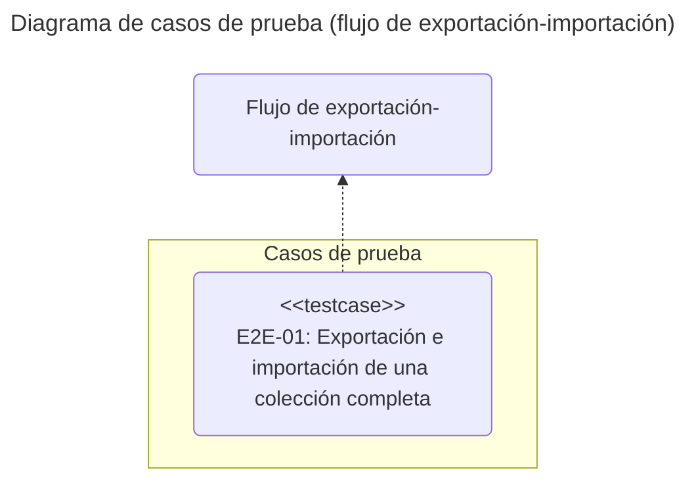
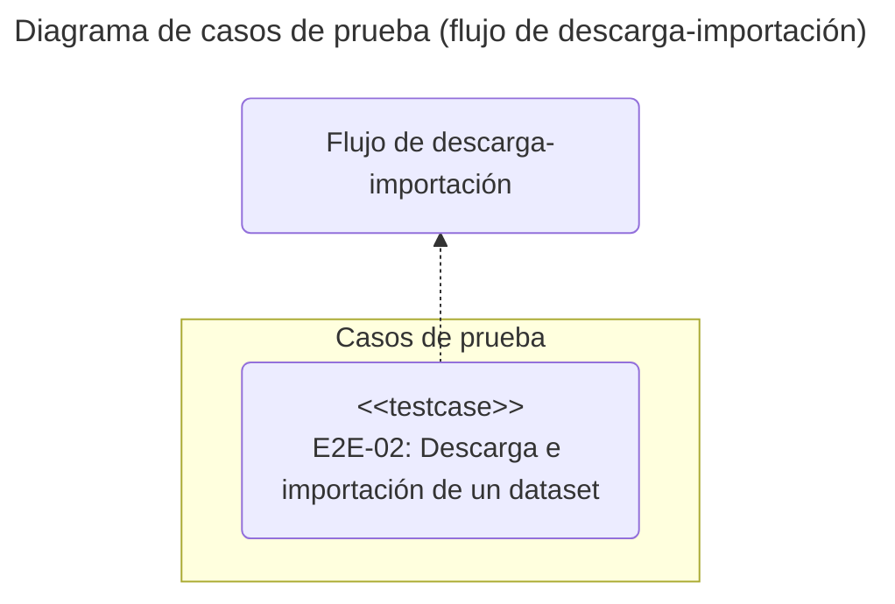

# Pruebas E2E: chromie

## Introducción

El objetivo de este documento es definir y describir los casos de prueba *End-to-End* (E2E) de la aplicación de línea de comandos **chromie**.
La idea es garantizar un enfoque estructurado, centrado en los flujos de trabajo completos que simulan escenarios de usuario reales de principio a fin.

Las pruebas se diseñan bajo un enfoque de **caja negra**, validando el comportamiento observable de la aplicación (entradas y salidas) sin conocimiento de su estructura interna.

## Alcance

Se validarán los flujos de trabajo completos de **chromie** que combinan múltiples comandos para lograr un objetivo final. Inicialmente, se cubrirá el siguiente flujo:

- **Exportación e importación**: Exportar una colección completa y luego importarla en una nueva colección.

- **Descarga e importación**: Descargar un *dataset* e importarlo en una nueva colección.

## Entorno de pruebas

Todas las pruebas se ejecutarán en un entorno controlado con la siguiente configuración:

Dependencia | Tipo | Descripción
:---: | :---: | :---
Hardware | Interna | Equipo con al menos 2GB de RAM
Sistema operativo | Interna | Ubuntu 24.04
Python | Interna | 3.13
Framework de pruebas | Interna | pytest 8.4
Chroma | Interna | Docker chromadb/chroma

Las pruebas se ubicarán en el directorio **tests/e2e** del proyecto.
Cada archivo de prueba debe presentar el prefijo **e2e_** y el sufijo **_test.py** como, por ejemplo, *e2e_exp_imp_test.py*.

## Casos de prueba

Un caso de prueba se considera **exitoso** si se cumplen todas sus condiciones de salida esperada.
Se considera **fallido** si una o más de estas condiciones no se cumplen.

### Flujo de exportación e importación

#### Exportación e importación de una colección completa (*E2E-01*)

- **Descripción**:
  Comprueba que el flujo completo de exportar los datos de una colección y luego importarlos a una nueva colección funciona correctamente, manteniendo la integridad de los datos.

- **Tipo**:
  L/E.

- **Precondiciones**:
  
  - La base de datos contiene una colección con al menos un registro.

- **Poscondiciones**:

  - Se crea una nueva colección en la base de datos.

  - La nueva colección contiene el mismo número de registros que la colección original.

- **Salida esperada**:

  - **Código de salida**: 0 para ambos comandos (**`chromie exp`** y **`chromie imp`**).

  - **Salida estándar**: Se muestran los informes de las operaciones de exportación e importación, indicando el número de registros procesados en cada caso.

### Flujo de descarga e importación

#### Descarga e importación de un dataset (*E2E-02*)

- **Descripción**:
  Comprueba que el flujo completo de descargar un *dataset* y luego importarlo a una nueva colección funciona correctamente.

- **Tipo**:
  L/E.

- **Precondiciones**:
  
  - Acceso a Internet para descargar el *dataset*.

- **Poscondiciones**:

  - Se crea una nueva colección en la base de datos.

  - La nueva colección contiene los registros del *dataset*.

- **Salida esperada**:

  - **Código de salida**: 0 para ambos comandos (**`chromie dl`** y **`chromie imp`**).

  - **Salida estándar**: Se muestran los informes de las operaciones de descarga e importación.
