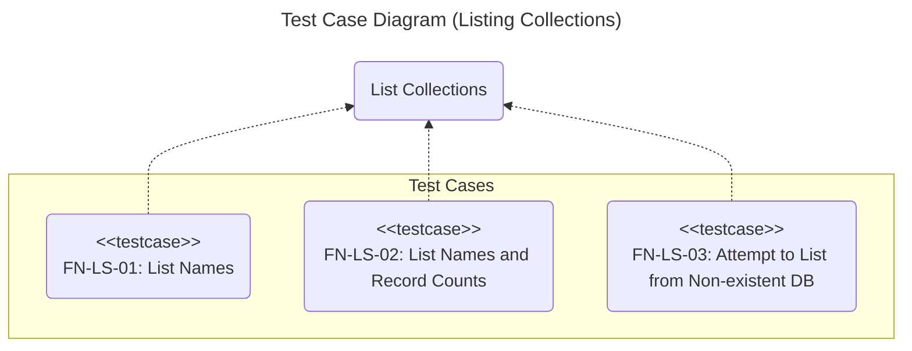
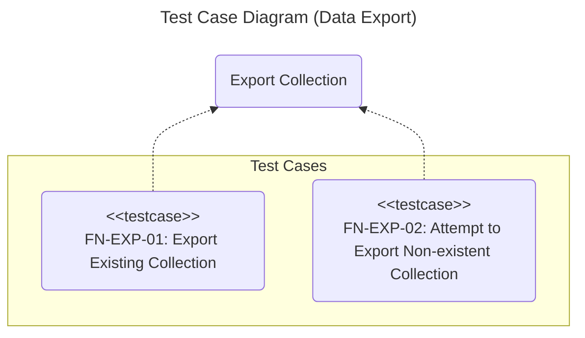
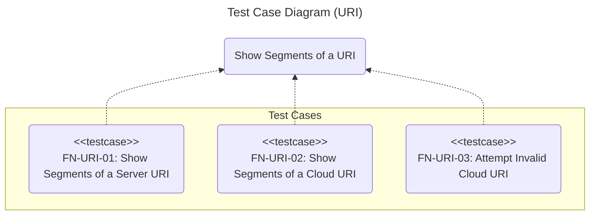
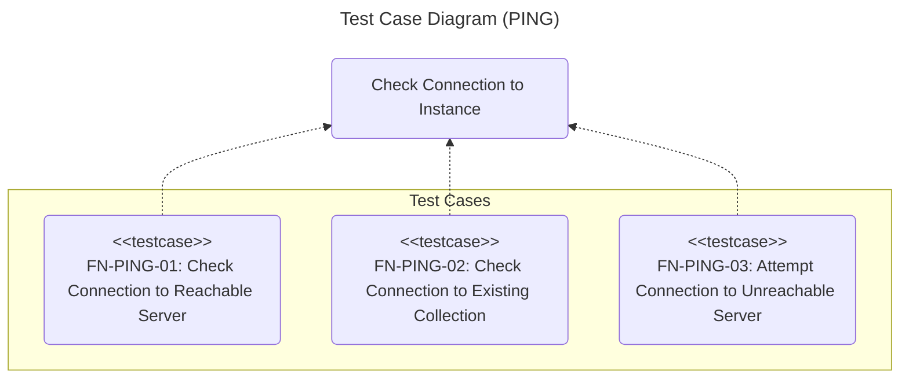

# Functional Tests: chromie

## Introduction

The purpose of this document is to define and describe the functional test cases for the **chromie** command-line application.
The idea is to ensure a structured approach, focusing on the tool's core functionalities.
It serves as a guide for the execution, validation, and documentation of the tests.

The tests are designed using a **black-box** approach, validating the application's observable behavior (inputs and outputs) without knowledge of its internal structure.

## Scope

The main functionalities of **chromie** will be validated through its following main commands:

- **`chromie ls`**: Listing collections.

- **`chromie exp`**: Exporting data from a collection.

- **`chromie imp`**: Importing data into a collection.

## Test Environment

All tests will be executed in a controlled environment with the following configuration:

Dependency | Type | Description
:--: | :--: | :--
Hardware | Internal | Machine with at least 2GB of RAM
Operating System | Internal | Ubuntu 24.04
Python | Internal | 3.13
Testing Framework | Internal | pytest 8.4
Chroma | Internal | Docker chromadb/chroma

The tests will be located in the project's **tests/functional** directory.
Each test file must have the prefix **fn_** and the suffix **_test.py**, for example, *fn_exp_test.py*.

## Test Cases

A test case is considered **successful** if all its expected output conditions are met.
It is considered **failed** if one or more of these conditions are not met.

### Listing Collections (*LS*)

#### List Names (*FN-LS-01*)

- **Description**:
  Verifies that the **`chromie ls`** command lists the names of the collections present in an existing database.

- **Type**:
  Read.

- **Preconditions**:
  
  - The database contains at least two collections.

- **Postconditions**:
  The system state is not altered.

- **Expected Output**:

  - **Exit code**: 0.

  - **Standard output**: The names of all existing collections are displayed, one per line.

#### List Names and Record Counts (*FN-LS-02*)

- **Description**:
  Verifies that the **`chromie ls --count`** command lists the names and the number of records for each collection.

- **Type**:
  Read.

- **Preconditions**:

  - The database contains at least two collections with a variable number of records.

- **Postconditions**:
  The system state is not altered.

- **Expected Output**:

  - **Exit code**: 0.

  - **Standard output**: A table is displayed with the collection names and their corresponding record counts.

#### Attempt to List from an Inaccessible Database (*FN-LS-03*)

- **Description**:
  Verifies that **`chromie ls`** shows an error when it cannot access the database.

- **Type**:
  Read.

- **Preconditions**:
  None.

- **Postconditions**:
  The system state is not altered.

- **Expected Output**:

  - **Exit code**: 1.

  - **Error output**: An error message is displayed, reporting the inability to connect to the database.

### Data Export (*EXP*)

#### Export Existing Collection (*FN-EXP-01*)

- **Description**:
  Verifies that the **`chromie exp`** command correctly exports the records of an existing collection to a file.

- **Type**:
  Read.

- **Preconditions**:
  
  - The test collection exists and contains records.

- **Postconditions**:

  - A file is generated in **JSON** format.

  - The file contains the same number of items as records in the collection.

- **Expected Output**:

  - **Exit code**: 0.

  - **Standard output**: An operation report is displayed.

#### Attempt to Export Non-existent Collection (*FN-EXP-02*)

- **Description**:
  Verifies that the **`chromie exp`** command shows an error when trying to export a non-existent collection.

- **Type**:
  Read.

- **Preconditions**:
  The specified collection does not exist in the database.

- **Postconditions**:
  The system state is not altered.

- **Expected Output**:

  - **Exit code**: 1.
  
  - **Error output**: Error message indicating that the collection does not exist.

### Data Import (*IMP*)

#### Import into an Empty Collection (*FN-IMP-01*)

- **Description**:
  Verifies that the **`chromie imp`** command correctly imports records from a file into an existing, empty collection.

- **Type**:
  R/W.

- **Preconditions**:

  - The input file is valid and contains a known number of records.

  - The target collection exists and is empty.

- **Postconditions**:

  - The collection contains the same number of records as the input file.

- **Expected Output**:

  - **Exit code**: 0.

  - **Standard output**: An operation report is displayed.

#### Import into a Non-empty Collection (*FN-IMP-02*)

- **Description**:
  Verifies that the **`chromie imp`** command inserts records into an existing, non-empty collection.

- **Type**:
  R/W.

- **Preconditions**:

  - The input file is valid.

  - The target collection exists and contains records.

- **Postconditions**:

  - The collection contains the initial data plus the new data.

- **Expected Output**:

  - **Exit code**: 0.

  - **Standard output**: An operation report is displayed, indicating the number of records processed.

#### Attempt to Import into an Inaccessible Database (*FN-IMP-03*)

- **Description**:
  Verifies that **`chromie imp`** handles the error when the target database is not accessible.

- **Type**:
  No R/W.

- **Preconditions**:

  - The input file is valid.

- **Postconditions**:
  The state of any database is not altered.

- **Expected Output**:

  - **Exit code**: 1.

  - **Error output**: An error message is displayed, reporting the inability to connect to the database.

### URI Parser (*URI*)

#### Show Segments of a Server URI (*FN-URI-01*)

- **Description**:
  Verifies that **`chromie uri`** displays the segments of a server URI.

- **Type**:
  No R/W.

- **Preconditions**:
  
  - The **`CHROMA_PORT`** environment variable has been set to ***8008***.

- **Postconditions**:
  The state of any database is not altered.

- **Expected Output**:

  - **Exit code**: 0.

  - **Standard output**: Displays the URI segments.

#### Show Segments of a Cloud URI (*FN-URI-02*)

- **Description**:
  Verifies that **`chromie uri`** displays the segments of a *cloud* URI.

- **Type**:
  No R/W.

- **Preconditions**:
  
  - The **`CHROMA_TENANT`** and **`CHROMA_DATABASE`** environment variables have non-default values.

- **Postconditions**:
  The state of any database is not altered.

- **Expected Output**:

  - **Exit code**: 0.

  - **Standard output**: Displays the variable names with their respective values.

#### Attempt Invalid Cloud URI (*FN-URI-03*)

- **Description**:
  Verifies that **`chromie uri`** shows an error when the URI does not have a tenant.

- **Type**:
  No R/W.

- **Preconditions**:
  
  - The **`CHROMA_TENANT`** and **`CHROMA_DATABASE`** environment variables are not defined.

- **Postconditions**:
  The state of any database is not altered.

- **Expected Output**:

  - **Exit code**: 1.

  - **Error output**: Shows an error due to the missing tenant.

### URI Check (*PING*)

#### Check Connection to Reachable Server (*FN-PING-01*)

- **Description**:
  Verifies that **`chromie ping`** connects to a server and shows that everything went well.

- **Type**:
  No R/W.

- **Preconditions**:
  None.

- **Postconditions**:
  The state of any database is not altered.

- **Expected Output**:

  - **Exit code**: 0.

  - **Standard output**: Shows that communication was successful.

#### Check Connection to Existing Collection (*FN-PING-02*)

- **Description**:
  Verifies that **`chromie ping`** connects to a server and checks for the existence of a given collection, showing that everything went well.

- **Type**:
  No R/W.

- **Preconditions**:
  
  - The collection exists.

- **Postconditions**:
  The state of any database is not altered.

- **Expected Output**:

  - **Exit code**: 0.

  - **Standard output**: Shows that communication was successful.

#### Attempt Connection to Unreachable Server (*FN-PING-03*)

- **Description**:
  Verifies that **`chromie ping`** shows an error message when the server cannot be reached.

- **Type**:
  No R/W.

- **Preconditions**:
  None.

- **Postconditions**:
  The state of any database is not altered.

- **Expected Output**:

  - **Exit code**: 1.

  - **Error output**: Shows an error message.