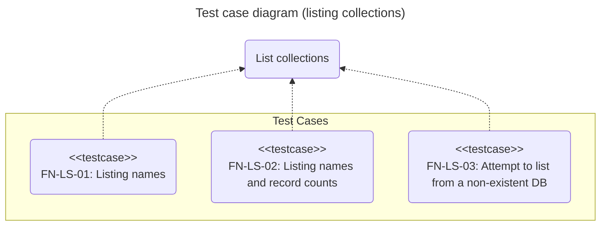
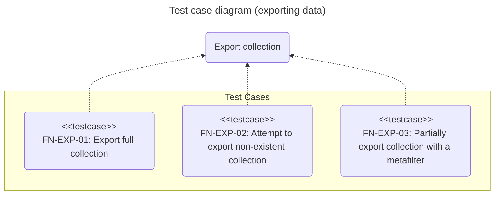
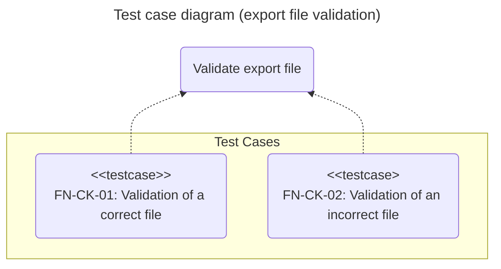

# Functional tests: chromie

## Introduction

The purpose of this document is to define and describe the functional test cases for the **chromie** command-line application.
The idea is to ensure a structured approach, focusing on the main functionalities of the tool.
It serves as a guide for the execution, validation, and documentation of the tests.

The tests are designed under a **black-box** approach, validating the observable behavior of the application (inputs and outputs) without knowledge of its internal structure.

## Scope

The main functionalities of **chromie** will be validated through its following main commands:

- **`chromie ls`**: Lists collections.

- **`chromie exp`**: Exports data from a collection.

- **`chromie imp`**: Imports data into a collection.

- **`chromie cp`**: Copies data from one collection to another.

## Test environment

All tests will be executed in a controlled environment with the following configuration:

Dependency | Type | Description
:--: | :--: | :--
Hardware | Internal | Machine with at least 2GB of RAM
Operating system | Internal | Ubuntu 24.04
Python | Internal | 3.13
Testing framework | Internal | pytest 8.4
Chroma | Internal | Docker chromadb/chroma

The tests will be located in the **tests/functional** directory of the project.
Each test file must have the prefix **fn_** and the suffix **_test.py**, for example, *fn_exp_test.py*.

## Test cases

A test case is considered **successful** if all its expected output conditions are met.
It is considered **failed** if one or more of these conditions are not met.

### Listing collections (*LS*)

#### Listing names (*FN-LS-01*)

- **Description**:
  Checks that the **`chromie ls`** command lists the names of the collections present in an existing database.

- **Type**:
  Read.

- **Pre-conditions**:
  
  - The database contains at least two collections.

- **Post-conditions**:
  The state of the system is not altered.

- **Expected output**:

  - **Exit code**: 0.

  - **Standard output**: The names of all existing collections are displayed, one per line.

#### Listing names and record counts (*FN-LS-02*)

- **Description**:
  Checks that the **`chromie ls --count`** command lists the names and the number of records for each collection.

- **Type**:
  Read.

- **Pre-conditions**:

  - The database contains at least two collections with a variable number of records.

- **Post-conditions**:
  The state of the system is not altered.

- **Expected output**:

  - **Exit code**: 0.

  - **Standard output**: A table is displayed with the names of the collections and their corresponding record counts.

#### Attempt to list from an inaccessible database (*FN-LS-03*)

- **Description**:
  Checks that **`chromie ls`** displays an error when it cannot access the database.

- **Type**:
  Read.

- **Pre-conditions**:
  None.

- **Post-conditions**:
  The state of the system is not altered.

- **Expected output**:

  - **Exit code**: 1.

  - **Error output**: An error message is displayed indicating the inability to connect to the database.

### Exporting data (*EXP*)

#### Export full collection (*FN-EXP-01*)

- **Description**:
  Checks that the **`chromie exp`** command correctly exports the records of an existing collection to a file.

- **Type**:
  Read.

- **Pre-conditions**:
  
  - The test collection exists and contains records.

- **Post-conditions**:

  - A file is generated in **JSON** format.

  - The file contains the same number of items as the collection has records.

- **Expected output**:

  - **Exit code**: 0.

  - **Standard output**: A report of the operation is displayed.

#### Attempt to export a non-existent collection (*FN-EXP-02*)

- **Description**:
  Checks that the **`chromie exp`** command displays an error when trying to export a non-existent collection.

- **Type**:
  Read.

- **Pre-conditions**:
  The specified collection does not exist in the database.

- **Post-conditions**:
  The state of the system is not altered.

- **Expected output**:

  - **Exit code**: 1.
  
  - **Error output**: Error message indicating that the collection does not exist.

#### Partially export collection with a metafilter (*FN-EXP-03*)

- **Description**:
  Checks that the **`chromie exp`** command correctly exports the records of an existing collection to a file, selecting only those that meet a certain metafilter.

- **Type**:
  Read.

- **Pre-conditions**:
  
  - The test collection exists and contains records.

- **Post-conditions**:

  - A file is generated in **JSON** format.

  - The file contains the number of items that match the records in the collection with that metadata.

- **Expected output**:

  - **Exit code**: 0.

  - **Standard output**: A report of the operation is displayed.

### Importing data (*IMP*)

#### Import into an empty collection (*FN-IMP-01*)

- **Description**:
  Checks that the **`chromie imp`** command correctly imports records from a file into an existing empty collection.

- **Type**:
  R/W.

- **Pre-conditions**:

  - The input file is valid and contains a known number of records.

  - The destination collection exists and is empty.

- **Post-conditions**:

  - The collection contains the same number of records as the input file.

- **Expected output**:

  - **Exit code**: 0.

  - **Standard output**: A report of the operation is displayed.

#### Import into a non-empty collection (*FN-IMP-02*)

- **Description**:
  Checks that the **`chromie imp`** command inserts records into an existing non-empty collection.

- **Type**:
  R/W.

- **Pre-conditions**:

  - The input file is valid.

  - The destination collection exists and contains records.

- **Post-conditions**:

  - The collection contains the initial data and the new data.

- **Expected output**:

  - **Exit code**: 0.

  - **Standard output**: A report of the operation is displayed, indicating the number of records processed.

#### Attempt to import into an inaccessible database (*FN-IMP-03*)

- **Description**:
  Checks that **`chromie imp`** handles the error when the destination database is not accessible.

- **Type**:
  No R/W.

- **Pre-conditions**:

  - The input file is valid.

- **Post-conditions**:
  The state of any database is not altered.

- **Expected output**:

  - **Exit code**: 1.

  - **Error output**: An error message is displayed indicating the inability to connect to the database.

### URI parser (*URI*)

#### Show segments of a server URI (*FN-URI-01*)

- **Description**:
  Checks that **`chromie uri`** displays the segments of a server URI.

- **Type**:
  No R/W.

- **Pre-conditions**:
  
  - The **`CHROMA_PORT`** environment variable has been set to ***8008***.

- **Post-conditions**:
  The state of any database is not altered.

- **Expected output**:

  - **Exit code**: 0.

  - **Standard output**: Displays the segments of the URI.

#### Show segments of a cloud URI (*FN-URI-02*)

- **Description**:
  Checks that **`chromie uri`** displays the segments of a *cloud* URI.

- **Type**:
  No R/W.

- **Pre-conditions**:
  
  - The **`CHROMA_TENANT`** and **`CHROMA_DATABASE`** environment variables have values different from the default ones.

- **Post-conditions**:
  The state of any database is not altered.

- **Expected output**:

  - **Exit code**: 0.

  - **Standard output**: Displays the names of the variables with their respective values.

#### Attempt with an invalid cloud URI (*FN-URI-03*)

- **Description**:
  Checks that **`chromie uri`** shows an error when the URI does not have a tenant.

- **Type**:
  No R/W.

- **Pre-conditions**:
  
  - The **`CHROMA_TENANT`** and **`CHROMA_DATABASE`** environment variables are not defined.

- **Post-conditions**:
  The state of any database is not altered.

- **Expected output**:

  - **Exit code**: 1.

  - **Error output**: Displays an error due to the lack of a tenant.

### URI check (*PING*)

#### Check connection to a reachable server (*FN-PING-01*)

- **Description**:
  Checks that **`chromie ping`** connects to a server and shows that everything went well.

- **Type**:
  No R/W.

- **Pre-conditions**:
  None.

- **Post-conditions**:
  The state of any database is not altered.

- **Expected output**:

  - **Exit code**: 0.

  - **Standard output**: Shows that communication was successful.

#### Check connection to an existing collection (*FN-PING-02*)

- **Description**:
  Checks that **`chromie ping`** connects to a server and verifies the existence of a given collection, showing that everything went well.

- **Type**:
  No R/W.

- **Pre-conditions**:
  
  - The collection exists.

- **Post-conditions**:
  The state of any database is not altered.

- **Expected output**:

  - **Exit code**: 0.

  - **Standard output**: Shows that communication was successful.

#### Attempt to connect to an unreachable server (*FN-PING-03*)

- **Description**:
  Checks that **`chromie uri`** displays an error message when the server cannot be reached.

- **Type**:
  No R/W.

- **Pre-conditions**:
  None.

- **Post-conditions**:
  The state of any database is not altered.

- **Expected output**:

  - **Exit code**: 1.

  - **Error output**: Displays an error message.

### Copying data (*CP*)

#### Copy a collection (*FN-CP-01*)

- **Description**:
  Checks that the **`chromie cp`** command correctly copies records from one collection to another.

- **Type**:
  R/W.

- **Pre-conditions**:

  - The source collection exists and contains a known number of records.

  - The destination collection exists and is empty.

- **Post-conditions**:

  - The destination collection contains the same number of records as the source.

- **Expected output**:

  - **Exit code**: 0.

  - **Standard output**: A report of the operation is displayed.

#### Attempt to copy from an unreachable source collection (*FN-CP-02*)

- **Description**:
  Checks that the **`chromie cp`** command handles the error when the source collection is not reachable.

- **Type**:
  R/W.

- **Pre-conditions**:

  - The source collection does not exist.

- **Post-conditions**:
  The state of any database is not altered.

- **Expected output**:

  - **Exit code**: 1.

  - **Error output**: An error message is displayed indicating the inability to connect to the source collection.

### Export file validation (*CK*)

#### Validation of a correct file (*FN-CK-01*)

- **Description**:
  Checks that the **`chromie check`** command validates an export file that complies with the schema.

- **Type**:
  Read-only.

- **Pre-conditions**:

  - The file to be validated exists.

- **Post-conditions**:
  The state of any database is not altered.

- **Expected output**:

  - **Exit code**: 0.

  - **Standard output**: Displays OK.

#### Validation of an incorrect file (*FN-CK-02*)

- **Description**:
  Checks that the **`chromie check`** command handles the error when the file does not comply with the schema.

- **Type**:
  Read-only.

- **Pre-conditions**:

  - The file to be validated exists.

- **Post-conditions**:
  The state of any database is not altered.

- **Expected output**:

  - **Exit code**: 1.

  - **Error output**: An error message is displayed reporting the problem.