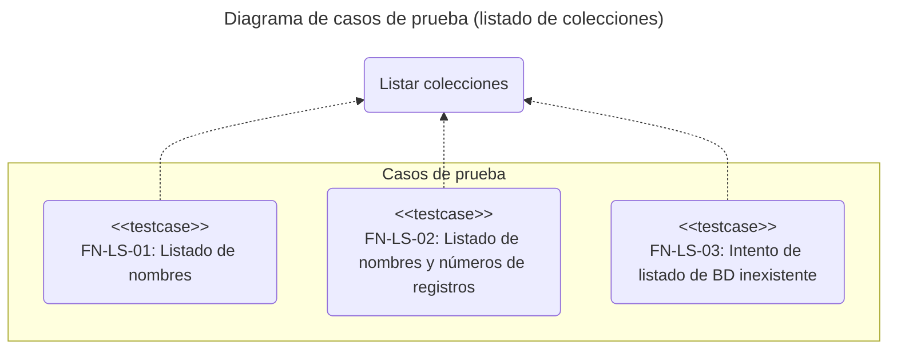
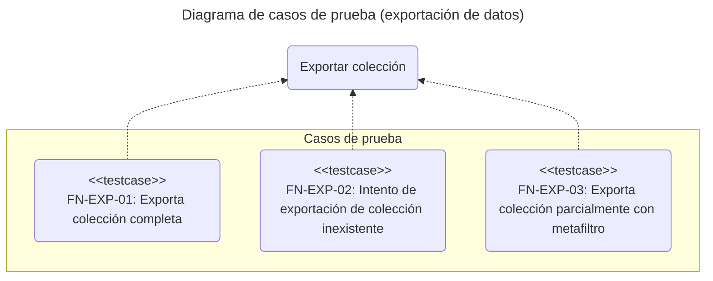
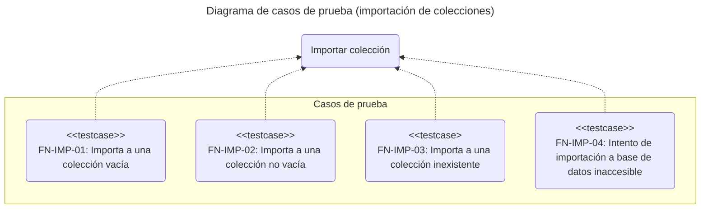
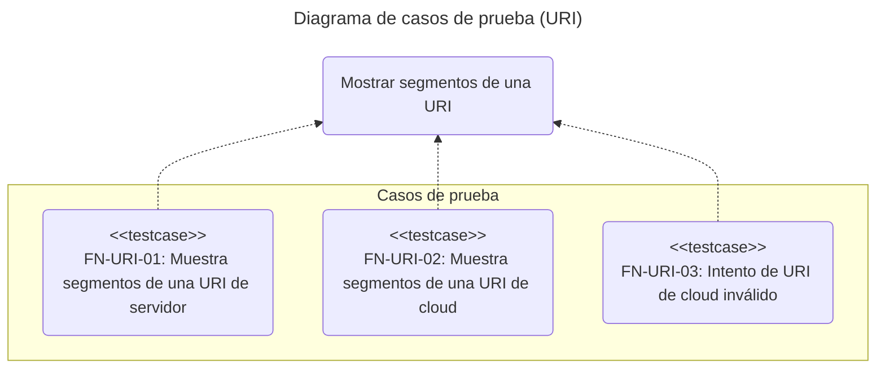
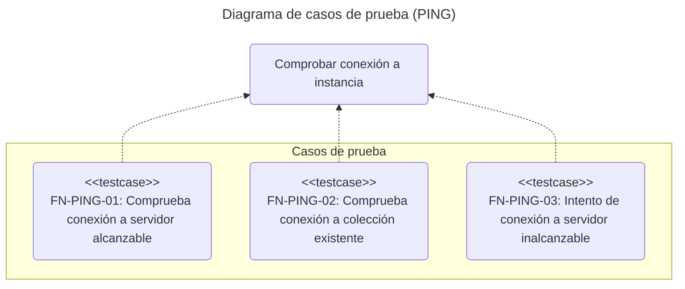
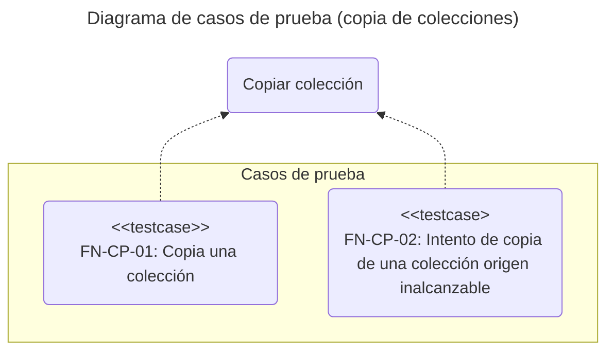
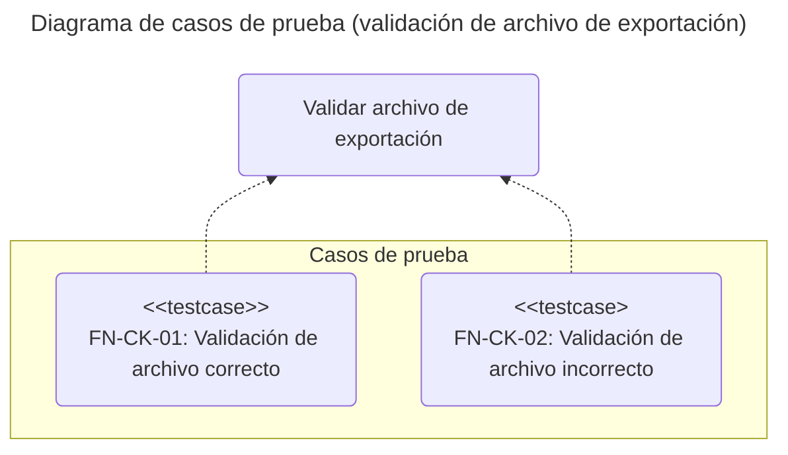

# Pruebas funcionales: chromie

## Introducción

El objetivo de este documento es definir y describir los casos de prueba funcionales de la aplicación de línea de comandos **chromie**.
La idea es garantizar un enfoque estructurado, centrado en las funcionalidades principales de la herramienta.
Sirve como guía para la ejecución, validación y documentación de las pruebas.

Las pruebas se diseñan bajo un enfoque de **caja negra**, validando el comportamiento observable de la aplicación (entradas y salidas) sin conocimiento de su estructura interna.

## Alcance

Se validarán las funcionalidades principales de **chromie** a través de sus comandos principales siguientes:

- **`chromie ls`**: Listado de colecciones.

- **`chromie exp`**: Exportación de datos de una colección.

- **`chromie imp`**: Importación de datos a una colección.

- **`chromie cp`**: Copia datos de una colección a otra.

## Entorno de pruebas

Todas las pruebas se ejecutarán en un entorno controlado con la siguiente configuración:

Dependencia | Tipo | Descripción
:--: | :--: | :--
Hardware | Interna | Equipo con al menos 2GB de RAM
Sistema operativo | Interna | Ubuntu 24.04
Python | Interna | 3.13
Framework de pruebas | Interna | pytest 8.4
Chroma | Interna | Docker chromadb/chroma

Las pruebas se ubicarán en el directorio **tests/functional** del proyecto.
Cada archivo de prueba debe presentar el prefijo **fn_** y el sufijo **_test.py** como, por ejemplo, *fn_exp_test.py*.

## Casos de prueba

Un caso de prueba se considera **exitoso** si se cumplen todas sus condiciones de salida esperada.
Se considera **fallido** si una o más de estas condiciones no se cumplen.

### Listado de colecciones (*LS*)

#### Listado de nombres (*FN-LS-01*)

- **Descripción**:
  Comprueba que el comando **`chromie ls`** lista los nombres de las colecciones presentes en una base de datos existente.

- **Tipo**:
  Lectura.

- **Precondiciones**:
  
  - La base de datos contiene al menos dos colecciones.

- **Poscondiciones**:
  No se altera el estado del sistema.

- **Salida esperada**:

  - **Código de salida**: 0.

  - **Salida estándar**: Se muestran los nombres de todas las colecciones existentes, uno por línea.

#### Listado de nombres y números de registros (*FN-LS-02*)

- **Descripción**:
  Comprueba que el comando **`chromie ls --count`** lista los nombres y el número de registros de cada colección.

- **Tipo**:
  Lectura.

- **Precondiciones**:

  - La base de datos contiene al menos dos colecciones con un número variable de registros.

- **Poscondiciones**:
  No se altera el estado del sistema.

- **Salida esperada**:

  - **Código de salida**: 0.

  - **Salida estándar**: Se muestra una tabla con los nombres de las colecciones y sus correspondientes números de registros.

#### Intento de listado en base de datos inaccesible (*FN-LS-03*)

- **Descripción**:
  Comprueba que **`chromie ls`** muestra un error cuando no puede acceder a la base de datos.

- **Tipo**:
  Lectura.

- **Precondiciones**:
  Ninguna.

- **Poscondiciones**:
  No se altera el estado del sistema.

- **Salida esperada**:

  - **Código de salida**: 1.

  - **Salida de error**: Se muestra un mensaje de error informando sobre la imposibilidad de conectar con la base de datos.

### Exportación de datos (*EXP*)

#### Exporta colección completa (*FN-EXP-01*)

- **Descripción**:
  Comprueba que el comando **`chromie exp`** exporta correctamente los registros de una colección existente a un archivo.

- **Tipo**:
  Lectura.

- **Precondiciones**:
  
  - La colección de prueba existe y contiene registros.

- **Poscondiciones**:

  - Se genera un archivo en formato **JSON**.

  - El archivo contiene el mismo número de elementos que registros tiene la colección.

- **Salida esperada**:

  - **Código de salida**: 0.

  - **Salida estándar**: Se muestra un informe de la operación.

#### Intento de exportación de colección inexistente (*FN-EXP-02*)

- **Descripción**:
  Comprueba que el comando **`chromie exp`** muestra un error al intentar exportar una colección inexistente.

- **Tipo**:
  Lectura.

- **Precondiciones**:
  La colección especificada no existe en la base de datos.

- **Poscondiciones**:
  No se altera el estado del sistema.

- **Salida esperada**:

  - **Código de salida**: 1.
  
  - **Salida de error**: Mensaje de error indicando que la colección no existe.

#### Exporta colección parcialmente con metafiltro (*FN-EXP-03*)

- **Descripción**:
  Comprueba que el comando **`chromie exp`** exporta correctamente los registros de una colección existente a un archivo, seleccionando sólo aquellos que cumplan un determinado metafiltro.

- **Tipo**:
  Lectura.

- **Precondiciones**:
  
  - La colección de prueba existe y contiene registros.

- **Poscondiciones**:

  - Se genera un archivo en formato **JSON**.

  - El archivo contiene el número de elementos que registros tiene la colección con ese metadato.

- **Salida esperada**:

  - **Código de salida**: 0.

  - **Salida estándar**: Se muestra un informe de la operación.

### Importación de datos (*IMP*)

#### Importa a una colección vacía (*FN-IMP-01*)

- **Descripción**:
  Comprueba que el comando **`chromie imp`** importa correctamente los registros de un archivo a una colección existente vacía.

- **Tipo**:
  L/E.

- **Precondiciones**:

  - El archivo de entrada es válido y contiene un número conocido de registros.

  - La colección de destino existe y está vacía.

- **Poscondiciones**:

  - La colección contiene el mismo número de registros que el archivo de entrada.

- **Salida esperada**:

  - **Código de salida**: 0.

  - **Salida estándar**: Se muestra un informe de la operación.

#### Importa a una colección no vacía (*FN-IMP-02*)

- **Descripción**:
  Comprueba que el comando **`chromie imp`** inserta los registros en una colección existente no vacía.

- **Tipo**:
  L/E.

- **Precondiciones**:

  - El archivo de entrada es válido.

  - La colección de destino existe y contiene registros.

- **Poscondiciones**:

  - La colección contiene los datos iniciales y los nuevos.

- **Salida esperada**:

  - **Código de salida**: 0.

  - **Salida estándar**: Se muestra un informe de la operación, indicando el número de registros procesados.

#### Intento de importación a base de datos inaccesible (*FN-IMP-03*)

- **Descripción**:
  Comprueba que **`chromie imp`** gestiona el error cuando la base de datos de destino no es accesible.

- **Tipo**:
  Sin L/E.

- **Precondiciones**:

  - El archivo de entrada es válido.

- **Poscondiciones**:
  No se altera el estado de ninguna base de datos.

- **Salida esperada**:

  - **Código de salida**: 1.

  - **Salida de error**: Se muestra un mensaje de error informando sobre la imposibilidad de conectar con la base de datos.

### Analizador de URIs (*URI*)

#### Muestra segmentos de una URI de servidor (*FN-URI-01*)

- **Descripción**:
  Comprueba que **`chromie uri`** muestra los segmentos de un URI de servidor.

- **Tipo**:
  Sin L/E.

- **Precondiciones**:
  
  - La variable de entorno **`CHROMA_PORT`** se ha definido a ***8008***.

- **Poscondiciones**:
  No se altera el estado de ninguna base de datos.

- **Salida esperada**:

  - **Código de salida**: 0.

  - **Salida estándar**: Muestra los segmentos del URI.

#### Muestra segmentos de una URI de cloud (*FN-URI-02*)

- **Descripción**:
  Comprueba que **`chromie uri`** muestra los segmentos de un URI de *cloud*.

- **Tipo**:
  Sin L/E.

- **Precondiciones**:
  
  - Las variables de entorno **`CHROMA_TENANT`** y **`CHROMA_DATABASE`** tienen valores diferentes a los predeterminados.

- **Poscondiciones**:
  No se altera el estado de ninguna base de datos.

- **Salida esperada**:

  - **Código de salida**: 0.

  - **Salida estándar**: Muestra los nombres de las variables con sus respectivos valores.

#### Intento de URI de cloud inválido (*FN-URI-03*)

- **Descripción**:
  Comprueba que **`chromie uri`** muestra error cuando la URI no presenta tenedor.

- **Tipo**:
  Sin L/E.

- **Precondiciones**:
  
  - Las variables de entorno **`CHROMA_TENANT`** y **`CHROMA_DATABASE`** no están definidas.

- **Poscondiciones**:
  No se altera el estado de ninguna base de datos.

- **Salida esperada**:

  - **Código de salida**: 1.

  - **Salida de error**: Muestra error debido a la falta de tenedor.

### Comprobación de URIs (*PING*)

#### Comprueba conexión a servidor alcanzable (*FN-PING-01*)

- **Descripción**:
  Comprueba que **`chromie ping`** conecta a un servidor y muestra que todo ha ido bien.

- **Tipo**:
  Sin L/E.

- **Precondiciones**:
  Ninguna.

- **Poscondiciones**:
  No se altera el estado de ninguna base de datos.

- **Salida esperada**:

  - **Código de salida**: 0.

  - **Salida estándar**: Muestra que comunicación realizada.

#### Comprueba conexión a colección existente (*FN-PING-02*)

- **Descripción**:
  Comprueba que **`chromie ping`** conecta a un servidor y comprueba la existencia de una colección dada, mostrando que todo ha ido bien.

- **Tipo**:
  Sin L/E.

- **Precondiciones**:
  
  - La colección existe.

- **Poscondiciones**:
  No se altera el estado de ninguna base de datos.

- **Salida esperada**:

  - **Código de salida**: 0.

  - **Salida estándar**: Muestra que comunicación realizada.

#### Intento de conexión a servidor inalcanzable (*FN-PING-03*)

- **Descripción**:
  Comprueba que **`chromie uri`** muestra un mensaje de error cuando servidor no se alcanza.

- **Tipo**:
  Sin L/E.

- **Precondiciones**:
  Ninguna.

- **Poscondiciones**:
  No se altera el estado de ninguna base de datos.

- **Salida esperada**:

  - **Código de salida**: 1.

  - **Salida de error**: Muestra mensaje de error.

### Copia de datos (*CP*)

#### Copia una colección (*FN-CP-01*)

- **Descripción**:
  Comprueba que el comando **`chromie cp`** copia correctamente los registros de una colección a otra.

- **Tipo**:
  L/E.

- **Precondiciones**:

  - La colección origen existe y contiene un número conocido de registros.

  - La colección destino existe y está vacía.

- **Poscondiciones**:

  - La colección destino contiene el mismo número de registros que la de entrada.

- **Salida esperada**:

  - **Código de salida**: 0.

  - **Salida estándar**: Se muestra un informe de la operación.

#### Intento de copia de una colección origen inalcanzable (*FN-CP-02*)

- **Descripción**:
  Comprueba que el comando **`chromie cp`** gestiona el error cuando la colección origen no es alcanzable.

- **Tipo**:
  L/E.

- **Precondiciones**:

  - La colección origen no existe.

- **Poscondiciones**:
  No se altera el estado de ninguna base de datos.

- **Salida esperada**:

  - **Código de salida**: 1.

  - **Salida de error**: Se muestra un mensaje de error informando sobre la imposibilidad de conectar con la colección origen.

### Validación de archivo de exportación (*CK*)

#### Validación de archivo correcto (*FN-CK-01*)

- **Descripción**:
  Comprueba que el comando **`chromie check`** valida un archivo de exportación que cumple con el esquema.

- **Tipo**:
  Sólo lectura.

- **Precondiciones**:

  - El archivo a validar existe.

- **Poscondiciones**:
  No se altera el estado de ninguna base de datos.

- **Salida esperada**:

  - **Código de salida**: 0.

  - **Salida estándar**: Muestra OK.

#### Validación de archivo incorrecto (*FN-CK-02*)

- **Descripción**:
  Comprueba que el comando **`chromie check`** gestiona el error cuando el archivo no cumple con el esquema.

- **Tipo**:
  Sólo lectura.

- **Precondiciones**:

  - El archivo a validar existe.

- **Poscondiciones**:
  No se altera el estado de ninguna base de datos.

- **Salida esperada**:

  - **Código de salida**: 1.

  - **Salida de error**: Se muestra un mensaje de error informando del problema.
