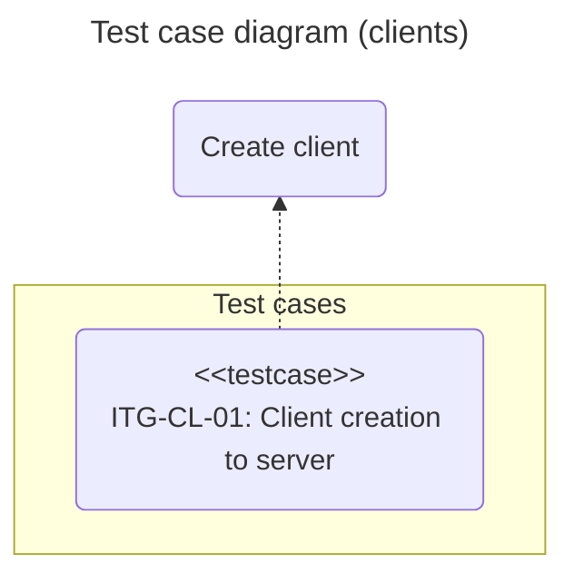
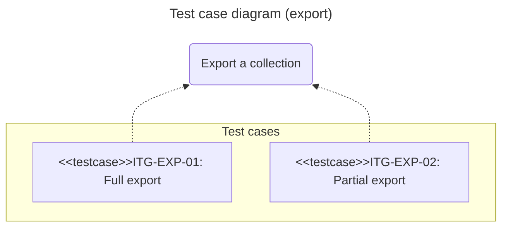
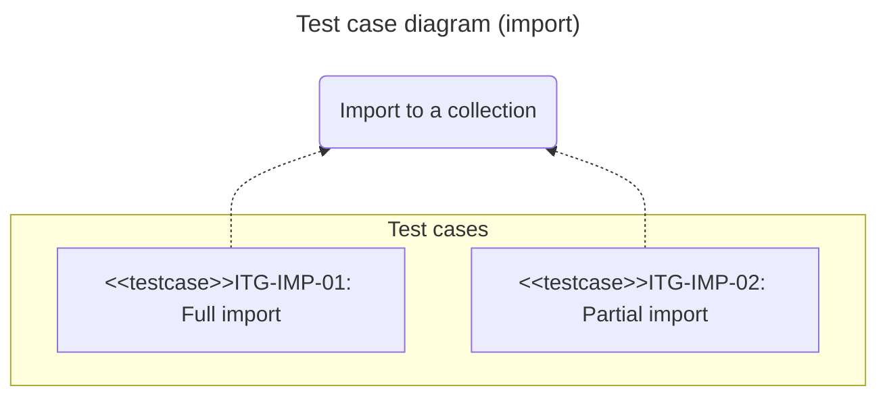

# Integration tests: chromio

## Introduction

This document defines the integration test cases for the **chromio** library.
The objective is to validate the correct interaction between its internal modules and with external services, mainly a real instance of the **Chroma** database.

The methodology used is **gray box**, where there is knowledge of the internal architecture and the interfaces of the components to be integrated, but not of their detailed implementation.

## Scope

The tests focus on the integration of the following components and workflows of the **chromio** library:

- **`client`** module:
  Creation and management of Chroma clients from a URI.

- **`ie`** module (*Import/Export*):
  The implementation of exporters and importers with a **Chroma** database instance.

- **Full workflow**: 
  The ability to export data from a collection and re-import it, verifying data integrity.

## Test environment

The execution environment for the integration tests has the following configuration.

Dependency | Type | Description
:--: | :--: | :--
Hardware | Internal | Machine with at least 2GB of RAM
Operating system | Internal | Ubuntu 24.04
Python | Internal | 3.13
Test framework | Internal | pytest 8.4
Chroma | External | Docker chromadb/chroma

The tests will be located in the project's **tests/integration** directory.
Each test file must have the prefix **itg_** and the suffix **_test.py**, for example, *itg_exp_test.py*.

## Test cases

A test case is considered **successful** if the interaction between the components produces the result and final state defined in the expected output and postconditions.

### Client connectivity (*CL*)

#### Client creation to server (*ITG-CL-01*)

- **Description**:
  Checks that a **chromio** client (***`ChromioClient`***) can be created from a valid URI to an accessible **Chroma** server.

- **Type**:
  Read.

- **Preconditions**:
  
  - A **Chroma** instance running and accessible over the network.

- **Postconditions**:

  - A successful connection to the **Chroma** server is established.

- **Expected Output**:

  - The method returns an **`AsyncClientAPI`** instance representing an active connection to the database server.

### Data export (*EXP*)

#### Full export (*ITG-EXP-01*)

- **Description**:
  Checks that **`Exporter.export_coll()`** exports all records from a collection when no limit is specified.
- **Type**:
  Read.
  - **Preconditions**:

    - The collection contains more than two records.

- **Postconditions**:

  - An export file is generated in **JSON** format.

  - The file contains the same number of items as there are records in the collection.

  - All records have the **`id`**, **`metadata`**, and **`document`** fields.
- **Expected output**:

  The method returns a report object indicating the exact number of records exported and the path to the generated file.

#### Partial export (*ITG-EXP-02*)

- **Description**:
  Checks that **`Exporter.export_coll()`** exports a maximum number of records equal to the specified **`limit`**.

- **Type**:
  Read.

- **Preconditions**:

  - The collection contains more records than the limit to be applied (***2***).

- **Postconditions**:

  - An export file is generated in **JSON** format.

  - The file contains exactly the same number of items as specified in **`limit`**.

- **Expected Output**:

  - The method returns a report object indicating that the number of exported records matches the **`limit`**.

### Data import (*IMP*)

#### Full import (ITG-IMP-01)

- **Description**:
  Checks that **`Importer.import_coll()`** imports all records from a file into an empty collection when no limit is specified.

- **Type**:
  R/W.

- **Preconditions**:

  - The import file is valid and contains at least two records.

  - The destination collection exists and is empty.

- **Postconditions**:

  - The destination collection contains the same number of records as the import file.

- **Expected Output**:

  - The method returns a report object indicating the specific number of imported records.

#### Partial import (*ITG-IMP-02*)

- **Description**:
  Checks that **`Importer.import_coll()`** imports a maximum number of records equal to the specified `limit`.

- **Type**:
  R/W.

- **Preconditions**:

  - The import file contains more records than the limit to be applied (***2***).

  - The destination collection exists and is empty.

- **Postconditions**:

  - The destination collection contains exactly the number of records specified in `limit`.

- **Expected Output**:

  - The method returns a report object indicating the number of imported records, which matches the **`limit`**.