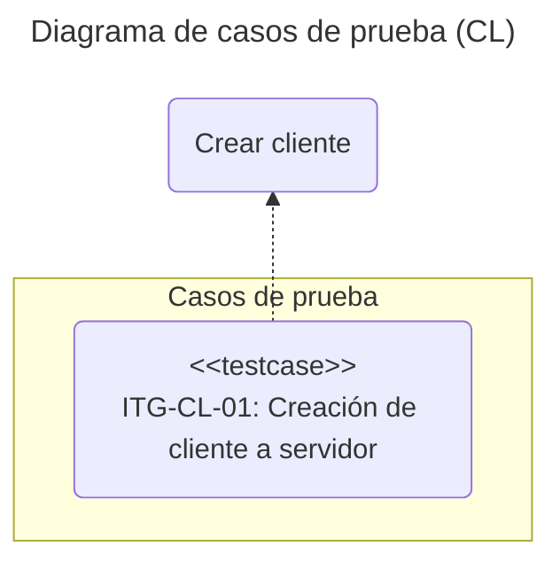
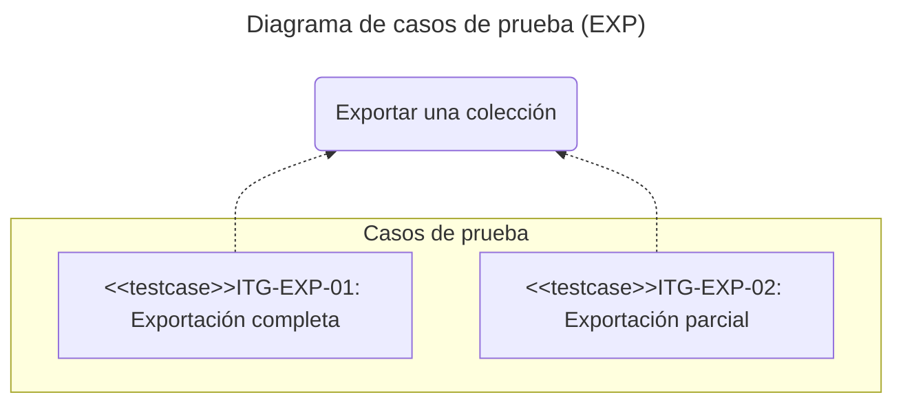
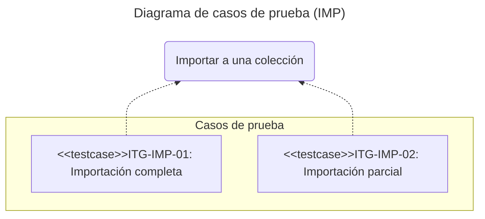
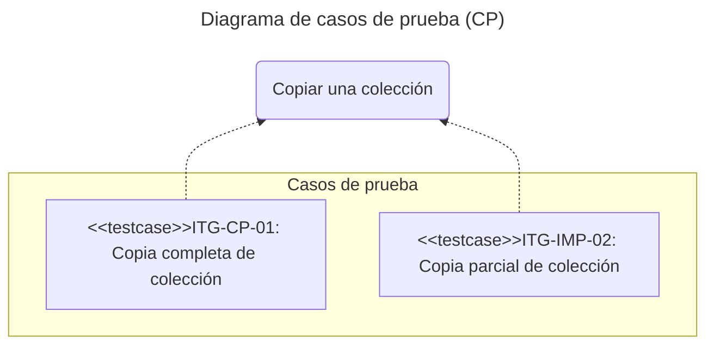

# Pruebas de integración: chromio

## Introducción

Este documento define los casos de prueba de integración para la librería **chromio**.
El objetivo es validar la correcta interacción entre sus módulos internos y con servicios externos, principalmente una instancia real de la base de datos **Chroma**.

La metodología empleada es la de **caja gris**, donde se tiene conocimiento de la arquitectura interna y de las interfaces de los componentes a integrar, pero no de su implementación detallada.

## Alcance

Las pruebas se centran en la integración de los siguientes componentes y flujos de trabajo de la librería **chromio**:

- Módulo **`client`**:
  Creación y gestión de clientes de Chroma a partir de una URI.

- Módulo **`ie`** (*Import/Export*):
  La implementación de los exportadores e importadores con una instancia de base de datos **Chroma**.

- **Flujo completo**: 
  La capacidad de exportar datos de una colección y volver a importarlos, verificando la integridad de los datos.

## Entorno de pruebas

El entorno de ejecución para las pruebas de integración presenta la siguiente configuración.

Dependencia | Tipo | Descripción
:--: | :--: | :--
Hardware | Interna | Equipo con al menos 2GB de RAM
Sistema operativo | Interna | Ubuntu 24.04
Python | Interna | 3.13
Framework de pruebas | Interna | pytest 8.4
Chroma | Externa | Docker chromadb/chroma

Las pruebas se ubicarán en el directorio **tests/integration** del proyecto.
Cada archivo de prueba debe presentar el prefijo **itg_** y el sufijo **_test.py** como, por ejemplo, *itg_exp_test.py*.

## Casos de prueba

Un caso de prueba se considera **exitoso** si la interacción entre los componentes produce el resultado y el estado final definidos en la salida esperada y las poscondiciones.

### Conectividad del cliente (*CL*)

#### Creación de cliente a servidor (*ITG-CL-01*)

- **Descripción**:
  Comprueba que se puede crear un cliente de **chromio** (***`ChromioClient`***) a partir de un URI válido a un servidor de **Chroma** accesible.

- **Tipo**:
  Lectura.

- **Precondiciones**:
  
  - Una instancia de **Chroma** en ejecución y accesible a través de la red.

- **Poscondiciones**:

  - Se establece una conexión exitosa con el servidor de **Chroma**.

- **Salida Esperada**:

  - El método devuelve una instancia **`AsyncClientAPI`** que representa una conexión activa al servidor de bases de datos.

### Exportación de datos (*EXP*)

#### Exportación completa (*ITG-EXP-01*)

- **Descripción**:
  Comprueba que **`CollExporter.export_coll()`** exporta todos los registros de una colección cuando no se especifica un límite.
- **Tipo**:
  Lectura.
  - **Precondiciones**:

    - La colección contiene más de dos registros.

- **Poscondiciones**:

  - Se genera un archivo de exportación en formato **JSON**.

  - El archivo contiene el mismo número de elementos que registros tiene la colección.

  - Todos los registros tienen los campos **`id`**, **`metadata`** y **`document`**.
- **Salida esperada**:

  El método devuelve un objeto-informe que indica el número exacto de registros exportados y la ruta al archivo generado.

#### Exportación parcial (*ITG-EXP-02*)

- **Descripción**:
  Comprueba que **`CollExporter.export_coll()`** exporta un número máximo de registros igual al **`limit`** especificado.

- **Tipo**:
  Lectura.

- **Precondiciones**:

  - La colección contiene más registros que el límite a aplicar (***2***).

- **Poscondiciones**:

  - Se genera un archivo de exportación en formato **JSON**.

  - El archivo contiene exactamente el mismo número de elementos que el especificado en **`limit`**.

- **Salida Esperada**:

  - El método devuelve un objeto-informe que indica que el número de registros exportados, el cual coincide con el **`limit`**.

### Importación de datos (*IMP*)

#### Importación completa (ITG-IMP-01)

- **Descripción**:
  Comprueba que **`CollImporter.import_coll()`** importa todos los registros de un archivo a una colección vacía cuando no se especifica un límite.

- **Tipo**:
  L/E.

- **Precondiciones**:

  - El archivo de importación es válido y contiene al menos dos registros.

  - La colección destino existe y está vacía.

- **Poscondiciones**:

  - La colección destino contiene el mismo número de registros que el archivo de importación.

- **Salida Esperada**:

  - El método devuelve un objeto-informe que indica el número concreto de registros importados.

#### Importación parcial (*ITG-IMP-02*)

- **Descripción**:
  Comprueba que **`CollImporter.import_coll()`** importa un número máximo de registros igual el `limit` especificado.

- **Tipo**:
  L/E.

- **Precondiciones**:

  - El archivo de importación contiene más registros que el límite a aplicar (***2***).

  - La colección destino existe y está vacía.

- **Poscondiciones**:

  - La colección destino contiene exactamente el número de registros especificado en `limit`.

- **Salida Esperada**:

  - El método devuelve un objeto-informe que indica el número de registros importados, coincide con **`limit`**.

### Copia de datos (*CP*)

#### Copia completa de colección (ITG-CP-01)

- **Descripción**:
  Comprueba que **`CollCopier.copy_coll()`** copia todos los registros de una colección en otra.

- **Tipo**:
  L/E.

- **Precondiciones**:

  - La colección origen dispone de más de un registro.

  - La colección destino existe y está vacía.

- **Poscondiciones**:

  - La colección destino contiene el mismo número de registros que la colección origen.

- **Salida Esperada**:

  - El método devuelve un objeto-informe que indica el número concreto de registros copiados.

#### Copia parcial de colección (*ITG-CP-02*)

- **Descripción**:
  Comprueba que **`CollCopier.copy_coll()`** copia un número máximo de registros igual que el **`limit`** especificado.

- **Tipo**:
  L/E.

- **Precondiciones**:

  - La colección origen contiene más registros que el límite a aplicar (***2***).

  - La colección destino existe y está vacía.

- **Poscondiciones**:

  - La colección destino contiene exactamente el número de registros especificado en **`limit`**.

- **Salida Esperada**:

  - El método devuelve un objeto-informe que indica el número de registros copiados, coincide con **`limit`**.
