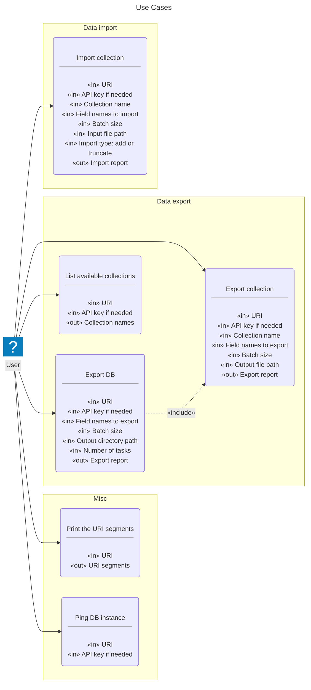

# Use Cases: Chromie

Users will interact with the application through the following use cases:

```mermaid
---
title: Use Cases
config:
---

graph LR
  user@{ icon: "fa:user", label: "User" }

  %%%%%%%%%%
  %% misc %%
  %%%%%%%%%%
  subgraph "Misc"
    printUriSegments@{ shape: "rounded", label: "
      Print the URI segments<hr>
      «in» URI
      «out» URI segments
    " }

    pingInstance@{ shape: "rounded", label: "
      Ping DB instance<hr>
      «in» URI
      «in» API key if needed
    " }
  end

  user --> printUriSegments
  user --> pingInstance

  %%%%%%%%%%%%
  %% export %%
  %%%%%%%%%%%%
  subgraph "Data export"
    exportColl@{ shape: "rounded", label: "
      Export collection<hr>
      «in» URI
      «in» API key if needed
      «in» Collection name
      «in» Field names to export
      «in» Batch size
      «in» Output file path
      «out» Export report
    " }

    exportDb@{ shape: "rounded", label: "
      Export DB<hr>
      «in» URI
      «in» API key if needed
      «in» Field names to export
      «in» Batch size
      «in» Output directory path
      «in» Number of tasks
      «out» Export report
    " }

    listColls@{ shape: "rounded", label: "
      List available collections<hr>
      «in» URI
      «in» API key if needed
      «out» Collection names
    " }
  end
  
  user --> exportColl
  user --> exportDb
  user --> listColls
  exportDb -.->|«include»| exportColl

  %%%%%%%%%%%%
  %% import %%
  %%%%%%%%%%%%
  subgraph "Data import"
    importColl@{ shape: "rounded", label: "
      Import collection<hr>
      «in» URI
      «in» API key if needed
      «in» Collection name
      «in» Field names to import
      «in» Batch size
      «in» Input file path
      «in» Import type: add or truncate
      «out» Import report
    " }
  end

  user --> importColl
```