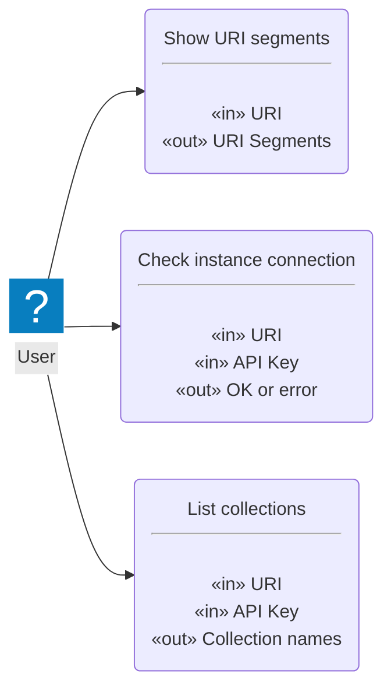
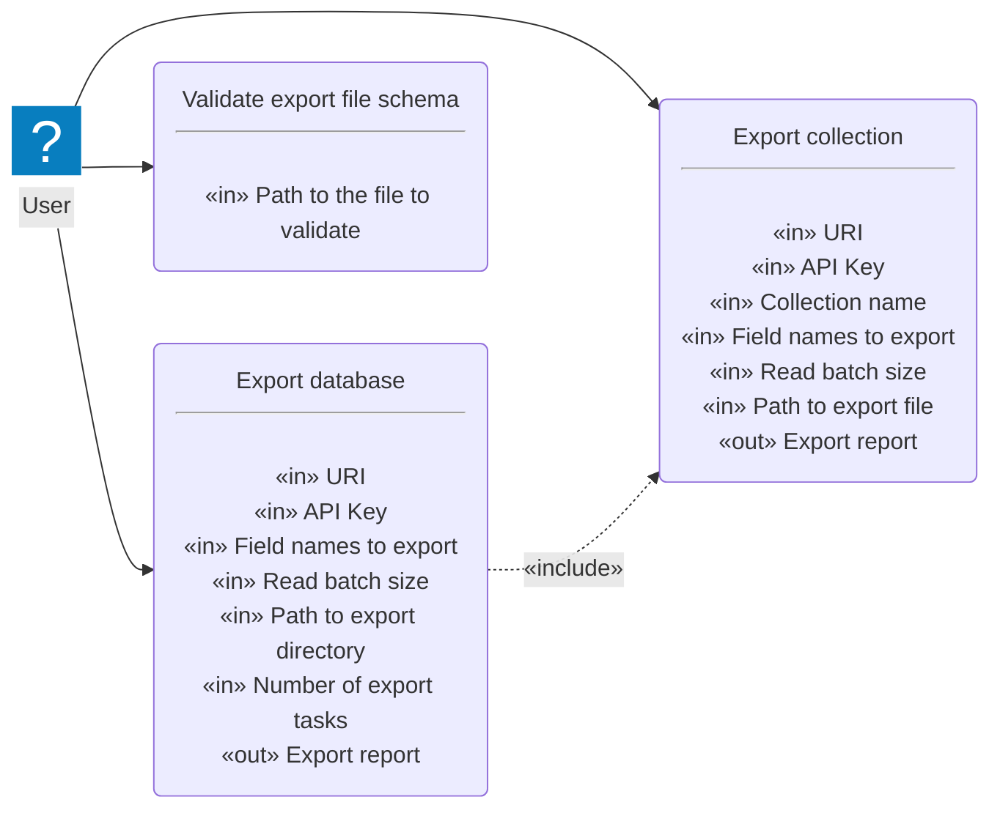
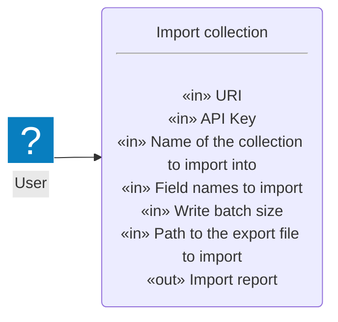
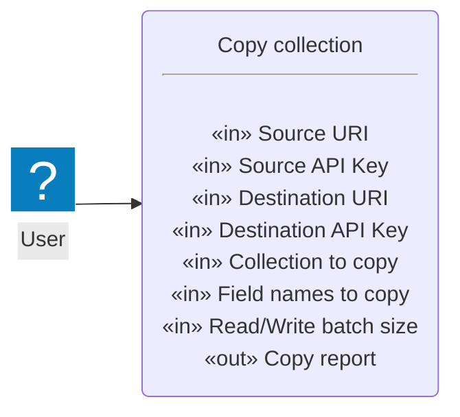
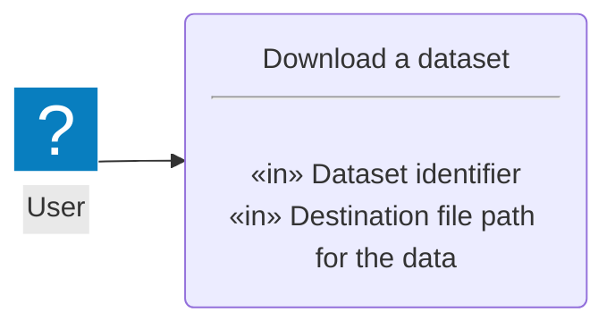

# Use cases: Chromie

## Actors

## Use cases

### Miscellaneous

#### Show URI segments

- **User story**:
  As a *user*,
  I want to *parse and know the segments of a URI*
  so that *I can know if I have written it correctly before using it*.

- **Priority**:
  High

- **Input**:

  - URI to parse.

- **Output**:

  - Segments of the parsed URI.

#### Check instance connection

- **User story**:
  As a *user*,
  I want to *check if I have access to an instance*
  so that *I know if I can connect to it to export and/or import*.

- **Priority**:
  High

- **Input**:

  - URI of the instance to connect to.

  - API key if required for the connection.

- **Output**:

  - Was the connection successful?

#### List available collections

- **User story**:
  As a *user*,
  I want to *know the available collections*,
  so that *I know which collections I can export or to which collections I can insert new records*.

- **Priority**:
  High

- **Input**:

  - URI of the instance to access.

  - API key if required to open the connection.

  - Do we want to know the number of records it has?

- **Output**:

  - List with the names of the collections and their counters if requested.

### Data export

#### Export collection

- **User story**:
  As a *user*,
  I want to *export the data from a collection*
  so that *I can import them into another collection, exchange them, or save them*.

- **Priority**:
  High

- **Input**:

  - Instance URI.

  - API key, if required, to connect to the instance.

  - Name of the collection to export.

  - Names of the fields to export.

  - Read batch size.

  - Path to the export file to be generated.

- **Output**:

  - Export report.

#### Export database

- **User story**:
  As a *user*,
  I want to *export the data from a database*
  so that *I can import them into another one, exchange them, or save them*.

- **Priority**:
  Low (can be implemented using *Export collection*)

- **Input**:

  - Instance URI.

  - API key, if required, to connect to the instance.

  - Names of the fields to export.

  - Read batch size.

  - Path to the export directory.

  - Number of concurrent export tasks.

- **Output**:

  - Export report.

#### Validate an export file's schema

- **User story**:
  As a *user*,
  I want to *validate the schema of an export file*
  so that *I can ensure that a manually generated one complies with the official schema*.

- **Priority**:
  High

- **Input**:

  - Path to the file to validate.

- **Output**:

  - OK or error.

### Data import

#### Import collection

- **User story**:
  As a *user*,
  I want to *import an export file*
  so that *I can add its data to a collection*.

- **Priority**:
  High

- **Input**:

  - URI of the instance to work with.

  - API key if required for the connection.

  - Name of the collection to import into.

  - Names of the fields to import.

  - Write batch size.

  - Path of the export file to import.

- **Output**:

  - Import report.

### Data copy

#### Copy collection

- **User story**:
  As a *user*,
  I want to *make a copy of a collection in another instance*
  so that *I can move data between instances*.

- **Priority**:
  Medium

- **Input**:

  - URI of the source instance.

  - Source API key if required.

  - URI of the destination instance, it can be the same or another instance.

  - Destination API key if required.

  - Name of the collection to copy.

  - Names of the fields to copy.

  - R/W batch size.

- **Output**:

  - Copy report.

### Data download

#### Download a dataset

- **User story**:
  As a *user*,
  I want to *download a prepared dataset*
  so that *I can import it into a Chroma instance*.

- **Priority**:
  Medium

- **Input**:

  - Dataset identifier.

  - Destination file path to store the data.