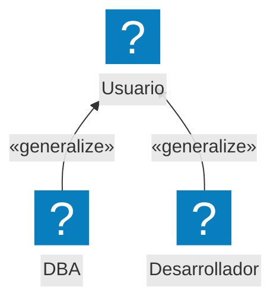
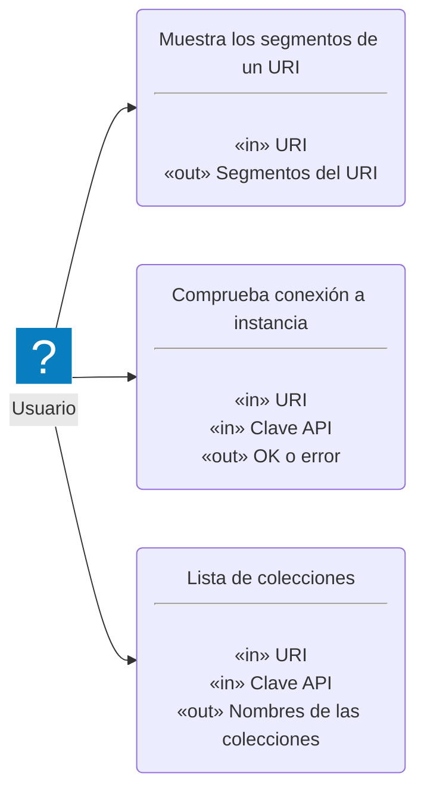
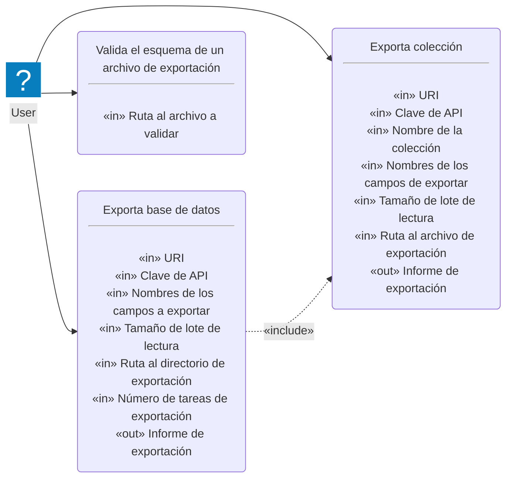
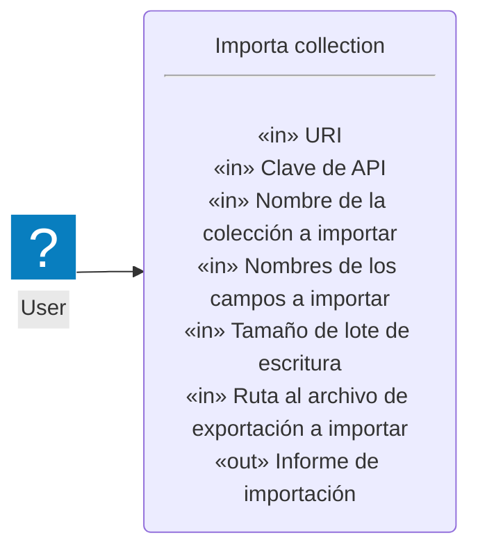
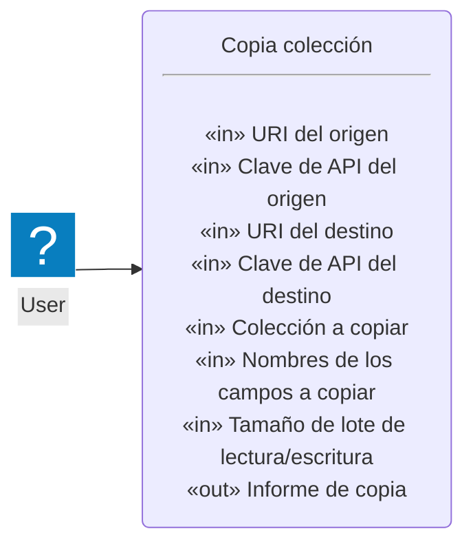
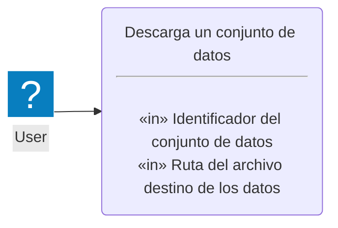

# Casos de uso: Chromie

## Actores

## Casos de uso

### Miscelánea

#### Muestra los segmentos de un URI

- **Historia de usuario**:
  Como *usuario*,
  quiero *analizar y conocer los segmentos de un URI*
  para *saber si lo he escrito adecuadamente antes de su uso*.

- **Prioridad**:
  Alta

- **Entrada**:

  - URI a analizar.

- **Salida**:

  - Segmentos del URI analizado.

#### Comprueba conexión a instancia

- **Historia de usuario**:
  Como *usuario*,
  quiero *comprobar si tengo acceso a una instancia*
  para *saber si puedo conectar a ella para exportar y/o importar*.

- **Prioridad**:
  Alta

- **Entrada**:

  - URI de la instancia a la que conectar.

  - Clave de API si fuera necesaria para conectar.

- **Salida**:

  - ¿Ha sido posible conectar?

#### Lista de colecciones disponibles

- **Historia de usuario**:
  Como *usuario*,
  quiero *conocer las colecciones disponibles*,
  para *saber qué colecciones puedo exportar o a qué colecciones puedo insertar nuevos registros*.

- **Prioridad**:
  Alta

- **Entrada**:

  - URI de la instancia a la que acceder.

  - Clave de API si fuera necesaria para abrir la conexión.

  - ¿Queremos saber el número de registros que tiene?

- **Salida**:

  - Lista con los nombres de las colecciones y sus contadores si se ha solicitado.

### Exportación de datos

#### Exporta colección

- **Historia de usuario**:
  Como *usuario*,
  quiero *exportar los datos de una colección*
  para *importarlos a otra colección, intercambiarlos o guardarlos*.

- **Prioridad**:
  Alta

- **Entrada**:

  - URI de la instancia.

  - Clave de la API, si fuera necesaria, para conectar a la instancia.

  - Nombre de la colección a exportar.

  - Nombres de los campos a exportar.

  - Tamaño de lote de lectura.

  - Ruta al archivo de exportación a generar.

- **Salida**:

  - Informe de exportación.

#### Exporta base de datos

- **Historia de usuario**:
  Como *usuario*,
  quiero *exportar los datos de una base de datos*
  para *importarlos a otra, intercambiarlos o guardarlos*.

- **Prioridad**:
  Baja (se puede implementar mediante *Exporta colección*)

- **Entrada**:

  - URI de la instancia.

  - Clave de la API, si fuera necesaria, para conectar a la instancia.

  - Nombres de los campos a exportar.

  - Tamaño de lote de lectura.

  - Ruta al directorio de exportación.

  - Número de tareas concurrentes de exportación.

- **Salida**:

  - Informe de exportación.

#### Valida el esquema de un archivo de exportación

- **Historia de usuario**:
  Como *usuario*,
  quiero *validar el esquema de un archivo de exportación*
  para *garantizar que uno generado explícitamente cumple con el oficial*.

- **Prioridad**:
  Alta

- **Entrada**:

  - Ruta al archivo a validar.

- **Salida**:

  - OK o error.

### Importación de datos

#### Importa colección

- **Historia de usuario**:
  Como *usuario*,
  quiero *importar un archivo de exportación*
  para *incorporar sus datos a una colección*.

- **Prioridad**:
  Alta

- **Entrada**:

  - URI de la instancia con la que trabajar.

  - Clave de API si fuera necesaria para conectar.

  - Nombre de la colección en la que importar.

  - Nombres de los campos a importar.

  - Tamaño de lote de escritura.

  - Ruta del archivo de exportación a importar.

- **Salida**:

  - Informe de importación.

### Copia de datos

#### Copia colección

- **Historia de usuario**:
  Como *usuario*,
  quiero *hacer una copia de una colección en otra instancia*
  para *mover datos entre instancias*.

- **Prioridad**:
  Media

- **Entrada**:

  - URI de la instancia origen de los datos.

  - Clave de API del origen si fuera necesaria.

  - URI de la instancia destino de los datos, puede ser la misma u otra instancia.

  - Clave de API del destino si fuera necesaria.

  - Nombre de la colección a copiar.

  - Nombres de los campos a copiar.

  - Tamaño de lote de L/E.

- **Salida**:

  - Informe de copia.

### Descarga de datos

#### Descarga de un conjunto de datos

- **Historia de usuario**:
  Como *usuario*,
  quiero *descargar un conjunto de datos preparado*
  para *su importación en una instancia de Chroma*.

- **Prioridad**:
  Media

- **Entrada**:

  - Identificador del conjunto de datos.

  - Ruta del archivo destino donde almacenar los datos.
